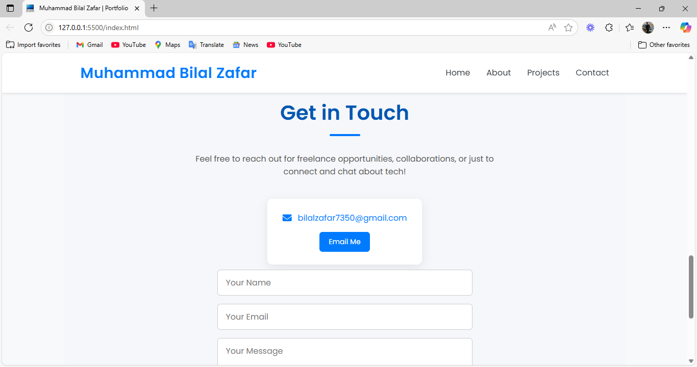
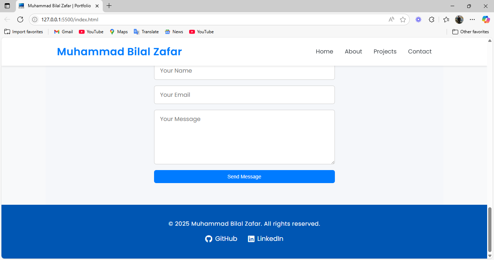

# 💼 Personal Portfolio Website

A clean, responsive, and modern personal portfolio website built using **HTML** and **CSS** only. This single-page layout is designed to showcase my skills, projects, and provide easy ways to connect with me.

## 🚀 Features

- Responsive design (mobile and desktop)
- Smooth layout with modern aesthetics
- Sections:
  - **Home**
  - **About Me**
  - **Projects**
  - **Contact**
  - **Footer with Social Links**

## 🛠️ Built With

- HTML5
- CSS3
- Font Awesome (for icons)

## 📷 Screenshots

[Screenshot 1](./img1.png)  
[Screenshot 2](./img2.png)
[Screenshot 3](./img3.png)  

## 📬 Contact

- Email: bilalzafar7350@gmail.com  
- LinkedIn: [https://www.linkedin.com/in/bilal-zafar-bb2a07276/](https://www.linkedin.com/in/bilal-zafar-bb2a07276/)  
- GitHub: [https://github.com/bilalzafar11](https://github.com/bilalzafar11)
